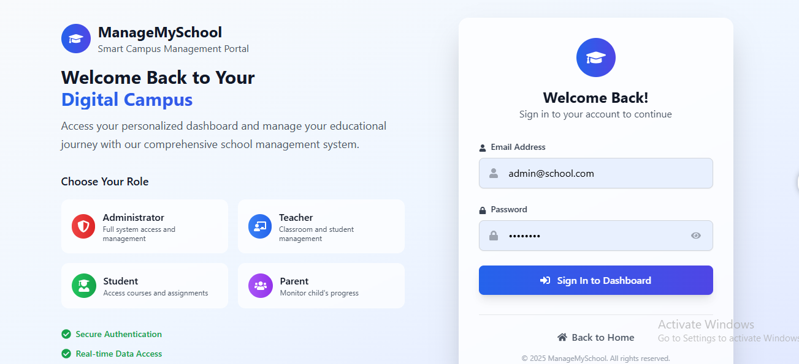
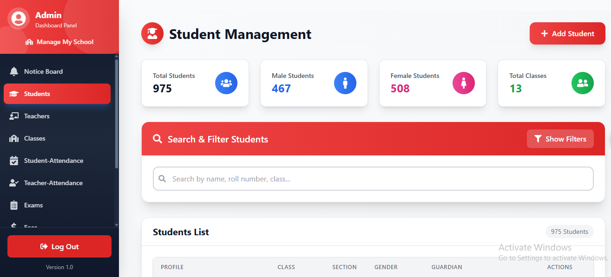
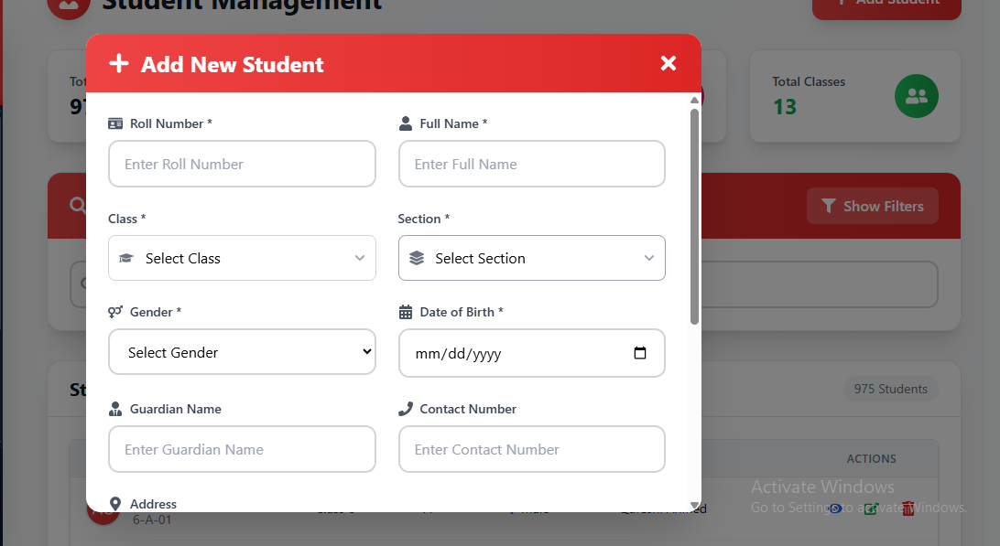
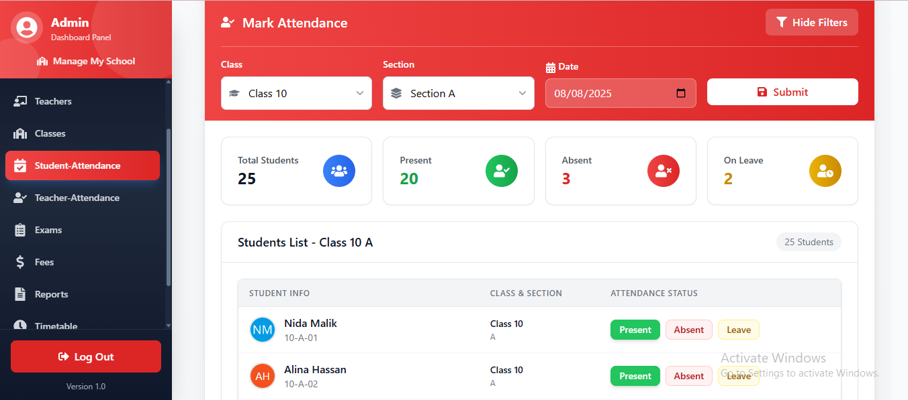
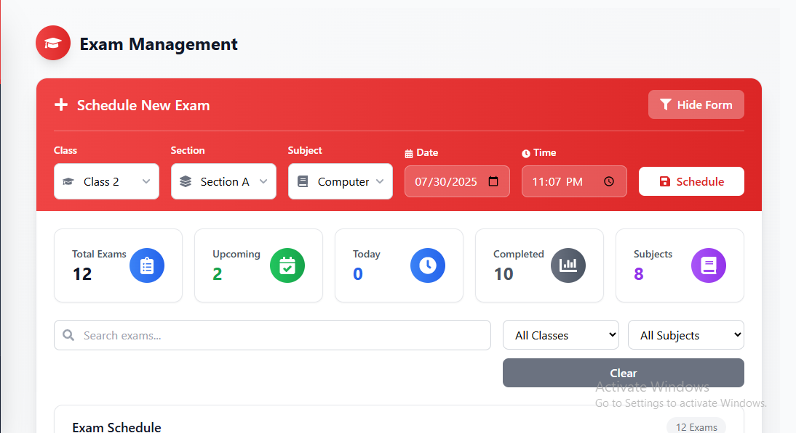
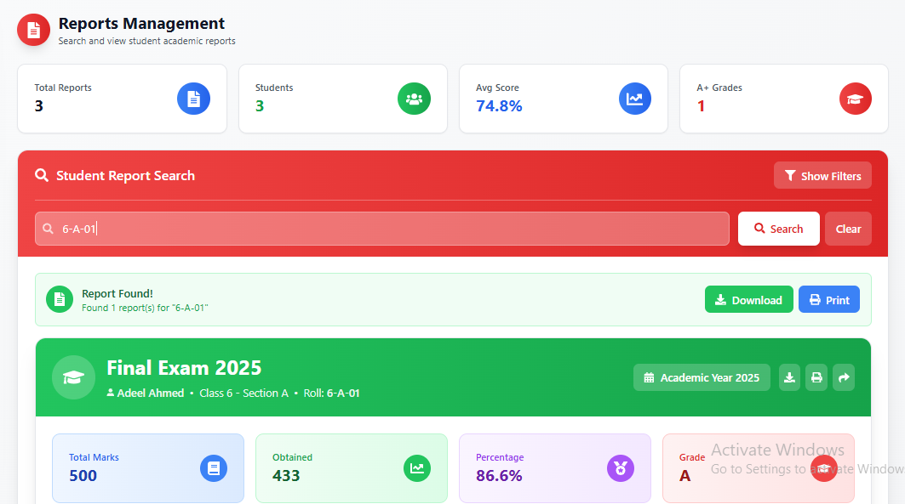
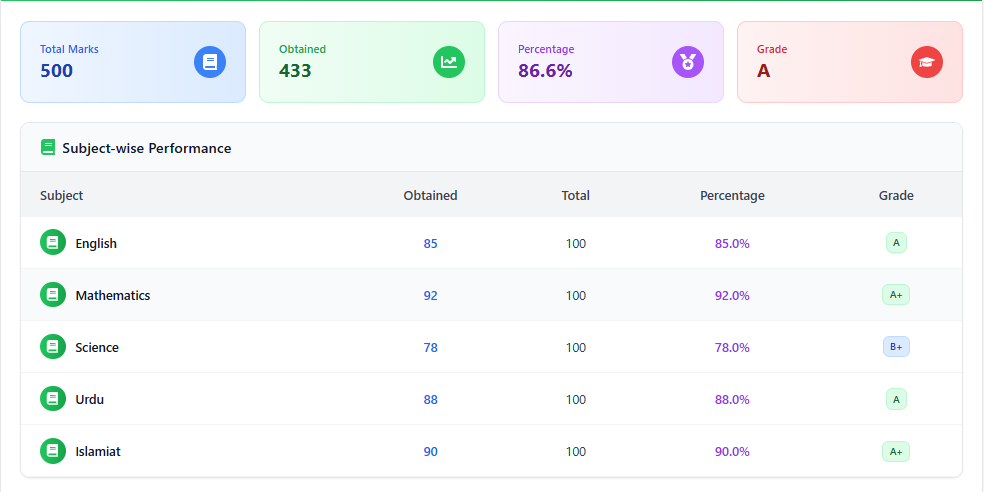
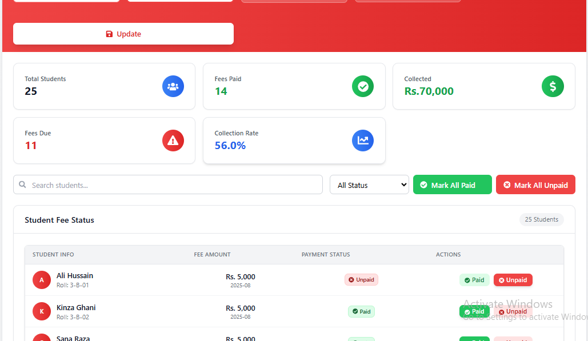

# ManageMySchool

School Management web app built with a modern React stack. It helps small/medium schools manage students, teachers, classes, attendance, exams, fees, dashboards, and simple messaging — all using **mock JSON data** during development.

> **Status:** Work-in-progress (WIP). This README also documents team roles, workflow, mock-data structure, and weekly milestones so the project is easy to pick up and contribute to.

---

## ✨ Features (MVP)

* **Authentication**: Login + protected routes, role-based access (Admin, Teacher, Student, Parent)
* **Routing & Layout**: Central layout wrapper, dynamic sidebar/topbar
* **Dashboards**: Role-specific overview pages (Admin/Teacher/Student/Parent)
* **Student Management**: List / Add / Edit / View students (CRUD via JSON)
* **Teacher Management**: List / Add / View teachers + assign classes
* **Class & Section Management**: View classes/sections + assign teachers
* **Attendance**: Mark daily attendance and view reports
* **Exams & Results**: Create exams, input marks, generate report cards
* **Fees**: View fees and generate mock receipts
* **Timetable**: Weekly class timetable UI
* **Settings/Profile**: Edit profile and change password (mock)
* **Responsive Design**: Mobile-first layouts
* **Utilities**: JSON fetcher, formatters, helpers

---

## 🧱 Tech Stack

* **Frontend:** React + Vite + Tailwind CSS
* **Routing:** React Router
* **State:** React hooks (local state) for MVP
* **Linting/Formatting:** Prettier 
* **Data Source (Dev):** Static JSON files served from `/public/data/*.json`

> Switch to a real API later by replacing the fetch layer without rewriting UI.

---

## 📁 Project Structure (proposed)

```
manageMySchool/
├─ public/
│  └─ data/
│     ├─ students.json
│     ├─ teachers.json
│     ├─ classes.json
│     ├─ attendance.json
│     ├─ exams.json
│     └─ fees.json
├─ src/
│  ├─ components/
│  │  ├─ Button.jsx
│  │  ├─ Card.jsx
│  │  ├─ FormInput.jsx
│  │  ├─ Modal.jsx
│  │  ├─ Navbar.jsx
│  │  └─ Sidebar.jsx
│  ├─ pages/
│  │  ├─ auth/
│  │  │  └─ Login.jsx
│  │  ├─ dashboard/
│  │  │  ├─ AdminDashboard.jsx
│  │  │  ├─ TeacherDashboard.jsx
│  │  │  ├─ StudentDashboard.jsx
│  │  │  └─ ParentDashboard.jsx
│  │  ├─ students/
│  │  │  ├─ StudentsList.jsx
│  │  │  ├─ StudentForm.jsx
│  │  │  └─ StudentView.jsx
│  │  ├─ teachers/
│  │  │  ├─ TeachersList.jsx
│  │  │  └─ AssignClasses.jsx
│  │  ├─ classes/
│  │  │  └─ ClassesSections.jsx
│  │  ├─ attendance/
│  │  │  ├─ MarkAttendance.jsx
│  │  │  └─ AttendanceReports.jsx
│  │  ├─ exams/
│  │  │  ├─ CreateExam.jsx
│  │  │  └─ Results.jsx
│  │  ├─ fees/
│  │  │  ├─ FeesList.jsx
│  │  │  └─ Receipt.jsx
│  │  ├─ timetable/
│  │  │  └─ Timetable.jsx
│  │  ├─ messaging/
│  │  │  └─ TeacherParentChat.jsx
│  │  └─ settings/
│  │     └─ Profile.jsx
│  ├─ routes/
│  │  ├─ AppRoutes.jsx
│  │  └─ ProtectedRoute.jsx
│  ├─ utils/
│  │  ├─ fetchJson.js
│  │  └─ formatters.js
│  ├─ styles/
│  │  └─ globals.css
│  ├─ main.jsx
│  └─ App.jsx
├─ package.json
└─ README.md
```

---

## 🔐 Authentication & Roles

* **Roles:** `admin`, `teacher`, `student`, `parent`
* **Protected Routes:** Use wrappers around role-allowed routes
* **Mock Users:** Keep demo credentials in a JSON file (e.g. `public/data/users.json`) or hard-coded constants during development

> **TODO:** Fill the table below with actual demo credentials once finalized.

| Role    | Username              | Password     | Notes                  |
| ------- | --------------------- | ------------ | ---------------------- |
| Admin   | `admin@example.com`   | `admin123`   | Full access            |
| Teacher | `teacher1@example.com` | `teacher123` | Class/attendance/exams |
| Student | `student1@example.com` | `student123` | Results/fees/timetable |
| Parent  | `parent1@example.com`  | `parent123`  | Messaging/fees         |


---

## 🗂️ Mock Data (Dev)

Place JSON files in `public/data/`:

```text
/public/data
  students.json
  teachers.json
  classes.json
  attendance.json
  exams.json
  fees.json
```

**Fetch example:**

```js
fetch('/data/students.json')
  .then((res) => res.json())
  .then((data) => setStudents(data));
```

**Data tips**

* Keep IDs stable for joining (e.g., `studentId`, `classId`)
* Normalize where possible; avoid deep nesting
* Add seed datasets for quick demos

---

## 🧩 Reusable Components

Create in `src/components/` and keep them UI-only:

* `Card.jsx`, `Table.jsx`, `Modal.jsx`, `FormInput.jsx`, `Button.jsx`, `Sidebar.jsx`, `Navbar.jsx`


---

## 🧭 Routing

* Use React Router with a central `AppRoutes.jsx`
* **ProtectedRoute** HOC/wrapper checks authentication and role
* Layout wrapper controls shared UI (navbar, sidebar) and page container

---

## 🛠️ Getting Started

### Prerequisites

* **Node.js** LTS (v20+ recommended)
* **npm** (comes with Node)

### Installation

```bash
# 1) Clone
git clone https://github.com/Malik3201/manageMySchool.git
cd manageMySchool

# 2) Install deps
npm install

# 3) Run dev server
npm run dev

# 4) Build for production
npm run build

# 5) Preview local production build
npm run preview
```


### Environment Variables

Not required for mock-JSON development. For future API integration, consider:

```
VITE_API_BASE_URL=
VITE_AUTH_PROVIDER=
```

---

## 🧑‍🤝‍🧑 Team & Ownership

**Developer 1 — Adeel (UI Lead, Routing, Students)**

* **Auth Module:** Login + Protected Routes
* **Routing & Layout:** Role-based routes + Layout wrapper
* **Dashboards:** Admin, Teacher, Student, Parent
* **Student Management:** List/Add/Edit/View students (CRUD with JSON)
* **Timetable Management:** Weekly class timetable
* **Results:**  input marks, generate report card
* **Settings/Profile:** Edit profile + change password


**Developer 2 — Abdul Rehman (Functional Pages, Teachers, Reports)**

* **Teacher Management:** List/Add/View teachers + Assign classes
* **Class & Section Mgmt:** View classes/sections + assign teachers
* **Attendance Mgmt:** Mark attendance, View reports
* **Fees Mgmt:** View fees, generate mock receipt
* **Announcements/Notice Board:** Post/view notices
* **Responsive Design:** Make all pages responsive
* **Utilities:** JSON fetcher, formatters, etc.
* **Reports Page:** Attendance, result, fees summaries, Add exam,
* **Dummy JSON Data:** Add seed data in `students.json`, `fees.json`, etc.

---

## 🔁 Daily Dev Workflow

1. **Start your day**

```bash
git pull origin main
```

2. **Create a feature branch**

```bash
git checkout -b feature/<feature-name>
# e.g., feature/student-management
```

3. **Develop** (run locally, meaningful commits)
4. **Push & PR**

```bash
git push origin feature/<feature-name>
```

* Open a Pull Request with a short summary
* Tag your partner for review

5. **After approval, merge to main**

```bash
git checkout main
git pull origin main
```

> Keep PRs small and focused; squash merge preferred.

---

## 📅 Weekly Milestones

| Week   | Target                                          |
| ------ | ----------------------------------------------- |
| Week 1 | Setup + Auth + Routing + Layout                 |
| Week 2 | Student + Teacher + Dashboard pages             |
| Week 3 | Classes + Attendance + Exams                    |
| Week 4 | Fees + Reports + Final Styling & Responsiveness |

> **Stand-ups:** Every 3 days (15 min) — quick progress review.

---

## 🧪 Testing (suggested)

* Component tests with **Vitest** + **@testing-library/react** (add later)
* Keep fixtures in `/public/data` or `/src/__fixtures__`

---

## 🧹 Code Quality

* ESLint with sensible rules; run on pre-commit if using Husky
* Prettier for formatting
* Folder-by-feature; avoid god components

---

## 📸 Screenshots / Demo


* Auth flow

* Admin dashboard

* Student CRUD

* Attendance mark & report

* Exams/Results

* Fees/Receipt


---

## 🗺️ Roadmap (post-MVP ideas)

* Replace mock JSON with REST/GraphQL backend
* Persist auth (JWT/cookies)
* Role-based permissions from server
* Import/export CSV for students and results
* Attendance via QR code or biometric integration (future)
* Real-time messaging (WebSocket)

---

## 🤝 Contributing

* Follow the **feature-branch → PR → review → merge** flow
* Use clear commit messages (`feat:`, `fix:`, `docs:`)
* Keep README updated with: installation steps, roles & demo logins, preview GIF/screenshots

---

## 📄 License

TBD (add your preferred license, e.g., MIT).

---

##  Acknowledgements

* React, Vite, Tailwind CSS
* Team: **Adeel** and **Abdul Rehman**

---
